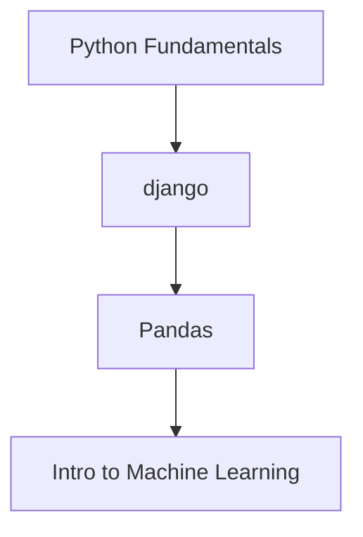

# 🧠 My Machine Learning Journey

## 📅 Phase 1 — The Beginning

**Start Date:** 6th February, 2025  
**Semester:** 6th Semester

I officially decided to start my machine learning journey today. At this point, I was hyped, curious, and a little overwhelmed—but hey, who isn’t when staring into the abyss of ML algorithms and datasets?

---

## ⚠️ Phase 2 — The Pause

I couldn’t continue the journey due to a lack of a proper plan. Life happened. Semesters rolled, and priorities shuffled like a poorly-written Python list.

But…

---

## 🚀 Phase 3 — The Comeback

**Restart Date:** 13th May, 2025

I’m now coming back, stronger and smarter, and this time I’ve got a **solid plan**. No more random tutorials or half-baked ideas. It’s structure, consistency, and execution from here on out.

---
---

## 🚀 Phase 4 — The Real deal

**Restart Date:** 1 october, 2025

I am ready
---

## 🗺️ Roadmap (in Progress)

